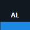

<p align="center">
  
</p>

<h1 align="center">AppLens</h1>

<p align="center">
  CSI's local control board for managing workstation apps, agents, evidence, and approvals.
</p>

<p align="center">
  <a href="https://github.com/CSI-Platform/AppLens/actions/workflows/dotnet.yml"></a>
  
  
</p>

## Overview

AppLens is CSI's mobile-OS-inspired local control board. It gives a workstation one place to see apps, agents, evidence, proposed actions, and operator approvals.

The platform is organized around apps/modules that publish state into CSI's proprietary blackboard layer:

- **Scanner**: local workstation inventory and readiness evidence.
- **Tune**: diagnostics, proposed fixes, approvals, execution records, and verification.
- **Blackboard**: the local evidence, status, policy, and action ledger.
- **Planner**: operator planning for multi-step local work.
- **Future modules**: Fleet, RAG, MCP, and Gov.

The current desktop app is the platform shell. It already hosts local scans, Tune diagnostics, dashboard read models, module status, exports, and blackboard-backed events.

## Safety Model

AppLens is local-first and operator-controlled:

- read-only scans by default
- approval-gated actions
- no automatic remediation without an explicit grant
- no telemetry, accounts, or cloud upload
- user-controlled report export
- default report redaction for user, machine, and profile-path details

## AppLens-desktop

AppLens-desktop is the WinUI 3 platform shell. It provides the local dashboard, machine summary, Scanner results, Tune diagnostics, module status, blackboard event views, and export options for JSON, Markdown, and local HTML reports.

Tune actions are modeled as proposals, approvals, executions, and verification records. System-changing behavior must remain explicit, reversible where practical, and blackboard-recorded.

Build and test:

```powershell
dotnet restore AppLensDesktop.sln
dotnet build AppLensDesktop.sln
dotnet test AppLensDesktop.sln
```

Run locally:

```powershell
.\tools\Run-AppLensDesktop.ps1
```

Package smoke build:

```powershell
.\tools\Build-StoreCandidate.ps1
```

More detail is in [docs/AppLensDesktop-Build.md](docs/AppLensDesktop-Build.md), [docs/AppLens-Platform-Scope.md](docs/AppLens-Platform-Scope.md), and [docs/Store-Readiness-Checklist.md](docs/Store-Readiness-Checklist.md).

Platform module docs:

- [Scanner](docs/AppLens-Scanner.md)
- [Tune](docs/AppLens-Tune-App.md)
- [Blackboard](docs/AppLens-Blackboard.md)
- [Planner](docs/AppLens-Planner.md)
- [Platform Shell](docs/AppLens-Platform-Shell.md)

## Script Usage

### Windows

Double-click:

```text
Run-AppLens.bat
Run-AppLens-Tune.bat
```

PowerShell:

```powershell
powershell -ExecutionPolicy Bypass -File AppLens.ps1
powershell -ExecutionPolicy Bypass -File AppLens-Tune.ps1
```

### macOS and Linux

```sh
chmod +x Run-AppLens.sh Run-AppLens-Tune.sh
./Run-AppLens.sh
./Run-AppLens-Tune.sh
```

Or run Python directly:

```sh
python3 AppLens.py
python3 AppLens-Tune.py
```

## Outputs

Script reports are written to the user's Desktop:

- `AppLens_Results_<ComputerName>.txt`
- `AppLens_Tune_Results_<ComputerName>.txt`

The desktop app exports:

- JSON
- Markdown
- local HTML

## Repository Layout

```text
src/AppLens.Backend         Native C# collectors, rules, blackboard, module status, reports
src/AppLens.Desktop         WinUI 3 platform shell
tests/AppLens.Backend.Tests Backend unit and golden report tests
docs/                      Platform, module, roadmap, build, and Store readiness notes
assets/                    Placeholder branding
```

## Project Status

AppLens is in preview. Scanner and Tune scripts are usable now. AppLens-desktop builds locally, has a package smoke build, and is being reframed as the CSI platform shell. Store submission still needs production branding, Partner Center identity, screenshots, a hosted privacy policy URL, and Windows App Certification Kit validation.
